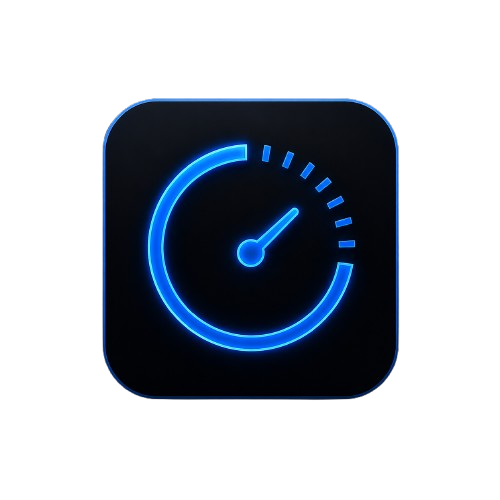
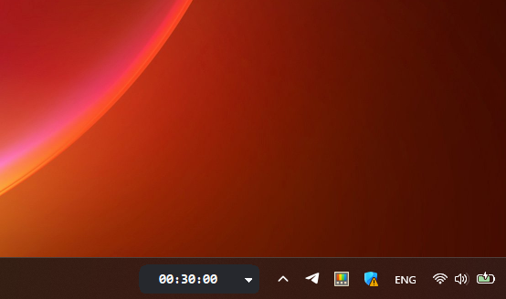
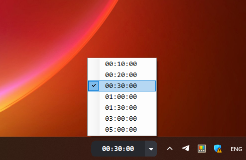
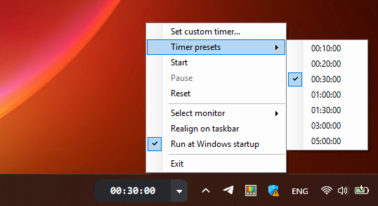
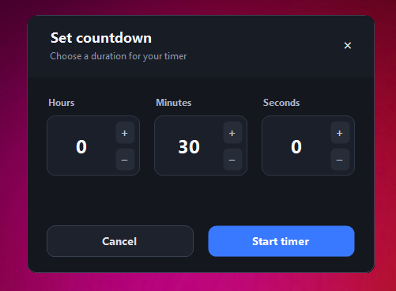

<p align="center">
  
</p>

<h1 align="center">Taskbar Timer Widget</h1>

<p align="center">
  A lightweight countdown timer that stays visible directly on the Windows taskbar.
</p>

<p align="center">
  <a href="https://github.com/VexloCa/TaskbarTimerWidget/actions/workflows/ci.yml"></a>
  <a href="https://github.com/VexloCa/TaskbarTimerWidget/releases/latest"></a>
  <a href="LICENSE"></a>
</p>

<p align="center">
  <a href="https://github.com/VexloCa/TaskbarTimerWidget/releases/latest"><strong>Download the latest release</strong></a>
</p>



Taskbar Timer Widget is made for focus sessions, meetings, breaks, presentations, cooking, and any other activity where the remaining time should always be easy to see. It uses a compact taskbar-aligned window and does not add a permanent application button to the taskbar.

## Features

- Always-visible `hh:mm:ss` countdown
- Seven built-in presets from 10 minutes to 5 hours
- Custom hours, minutes, and seconds
- Start, pause, resume, and reset controls
- Warning pulse during the final 10 seconds
- Sound alert and animated display when time expires
- Automatic light and dark taskbar theme matching
- Primary and secondary monitor support
- Per-monitor DPI-aware positioning
- Automatic realignment after display changes or an Explorer restart
- Collision avoidance for third-party taskbar widgets
- Optional launch at Windows sign-in
- Single-instance protection
- No administrator access, telemetry, or network connection required

## Screenshots

| Quick presets | Full context menu |
| --- | --- |
|  |  |

### Custom countdown



## Download and Install

Download the versioned ZIP and its `.sha256` file from [GitHub Releases](https://github.com/VexloCa/TaskbarTimerWidget/releases/latest), then extract the ZIP.

### Recommended: per-user installation

The installer copies the application to `%LOCALAPPDATA%\Programs\TaskbarTimerWidget` and creates a Start menu shortcut. It does not request administrator privileges.

Open PowerShell in the extracted directory and run:

```powershell
Unblock-File .\install.ps1, .\uninstall.ps1
.\install.ps1
```

To also launch the widget automatically when you sign in:

```powershell
.\install.ps1 -StartAtLogin
```

Exit a currently installed widget before running the installer again to upgrade it.

### Portable use

No installation is required. Extract the release and run `TaskbarTimerWidget.exe` from a stable directory. If you enable **Run at Windows startup**, do not move the executable afterward because Windows stores its current path.

> [!NOTE]
> Releases are currently unsigned. Windows SmartScreen may ask you to confirm the first launch. Download only from this repository and verify the SHA-256 checksum before running the application.

### Verify the download

The displayed hash should match the value in the downloaded `.sha256` file:

```powershell
Get-FileHash .\TaskbarTimerWidget-1.0.0-win.zip -Algorithm SHA256
Get-Content .\TaskbarTimerWidget-1.0.0-win.zip.sha256
```

Replace `1.0.0` with the version you downloaded.

### Uninstall

Exit the widget from its right-click menu, then run:

```powershell
& "$env:LOCALAPPDATA\Programs\TaskbarTimerWidget\uninstall.ps1"
```

The uninstaller removes the application, Start menu shortcut, startup entry, and saved preferences. Add `-KeepSettings` to preserve preferences.

## Usage

1. Click the arrow beside the timer and choose a preset.
2. Right-click the widget and choose **Start**.
3. Use the right-click menu to pause, resume, reset, move the widget to another monitor, or exit.

Selecting a preset prepares the timer without starting it. For an exact duration, choose **Set custom timer...**, enter the time, and select **Start timer**.

| Action | Control |
| --- | --- |
| Choose a preset | Click the arrow or open **Timer presets**. |
| Set an exact duration | Choose **Set custom timer...**. |
| Start | Choose **Start**. |
| Pause or resume | Choose **Pause** or **Resume**. |
| Restore the prepared duration | Choose **Reset**. |
| Move to another display | Open **Select monitor**. |
| Repair the position | Choose **Realign on taskbar**. |
| Launch at sign-in | Enable **Run at Windows startup**. |
| Close completely | Choose **Exit**. |

## Privacy and Permissions

Taskbar Timer Widget:

- runs with the current user's normal permissions;
- makes no network requests and contains no telemetry;
- stores preferences under `HKEY_CURRENT_USER\Software\TaskbarTimerWidget`;
- writes a `HKEY_CURRENT_USER\...\Run` value only when launch at sign-in is enabled; and
- does not inject code or controls into Windows Explorer.

See [SECURITY.md](SECURITY.md) for vulnerability reporting.

## Requirements

### Running

- Windows 10 or Windows 11; Windows 11 is the primary target
- .NET Framework 4.8 runtime

### Building

- Windows PowerShell 5.1 or later
- .NET Framework 4.8 Developer Pack

## Build and Test

Build the application and run all deterministic logic tests:

```powershell
.\build.ps1
```

Build, test, and create the versioned release ZIP and SHA-256 checksum under `artifacts/`:

```powershell
.\build.ps1 -Package
```

Run the live Windows/Explorer smoke test when changing taskbar integration:

```powershell
.\build.ps1 -RunSmokeTest
```

The smoke test briefly displays a second widget while checking taskbar discovery, ownership, docking, idle visibility, and Explorer recovery. The standard logic tests run without opening the widget.

## Automated Releases

Every push and pull request is built and tested on Windows by GitHub Actions. Pushing a tag such as `v1.0.0` triggers a release only when it matches the value in [`VERSION`](VERSION). The release workflow creates the ZIP, generates its checksum, and publishes both files to GitHub Releases.

Maintainers should follow [the release checklist](docs/RELEASING.md). One-time repository settings such as branch protection, topics, and private vulnerability reporting are listed in [the GitHub setup guide](docs/GITHUB_SETUP.md).

## How It Works

Windows 11 does not provide an official API for embedding arbitrary third-party controls in the modern taskbar. The application therefore uses a small borderless Windows Forms window aligned with and owned by the selected taskbar. This keeps the widget above the taskbar without modifying Windows Explorer.

The timer uses UTC timestamps, so an active countdown is not affected by daylight-saving or time-zone changes. Taskbar positioning, settings, and timer state live in separate classes under `src/`.

## Known Limitation

Taskbar placement depends on Windows Explorer's taskbar window hierarchy, which is not a public extension API and may change in future Windows updates. The application includes fallback positioning and automatic recovery, but unusual taskbar replacements may require manual realignment.

## Project Structure

```text
TaskbarTimerWidget/
|-- .github/                 # CI, release, and contribution templates
|-- assets/                  # Application icon and README screenshots
|-- docs/                    # Maintainer release guide
|-- src/
|   |-- Models/              # Presets and timer state machine
|   |-- Native/              # Win32 interop declarations
|   |-- Properties/          # Executable metadata
|   |-- Services/            # Docking and persisted settings
|   |-- TaskbarTimerWidget.cs
|   `-- app.manifest
|-- tests/                   # Logic and live smoke tests
|-- build.ps1                # Build, test, and package entry point
|-- install.ps1              # Optional per-user installer
|-- uninstall.ps1            # Per-user uninstaller
`-- VERSION                  # Release version source of truth
```

## Contributing

Bug reports and focused pull requests are welcome. Read [CONTRIBUTING.md](CONTRIBUTING.md) before submitting a change, and see [CHANGELOG.md](CHANGELOG.md) for release history.

## License

Taskbar Timer Widget is available under the [MIT License](LICENSE).
